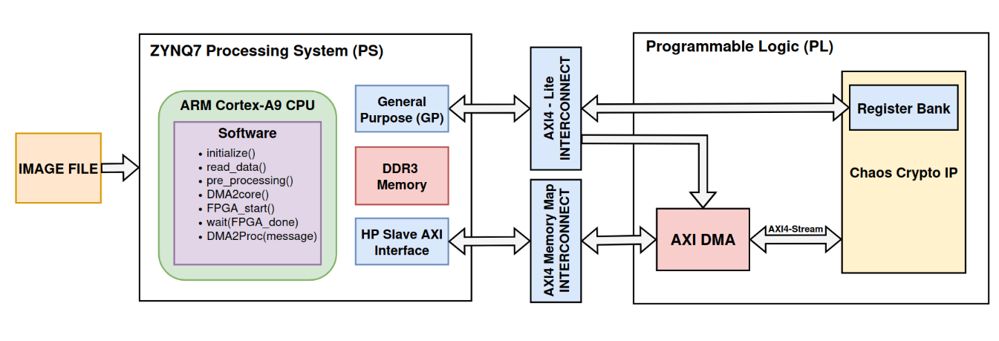
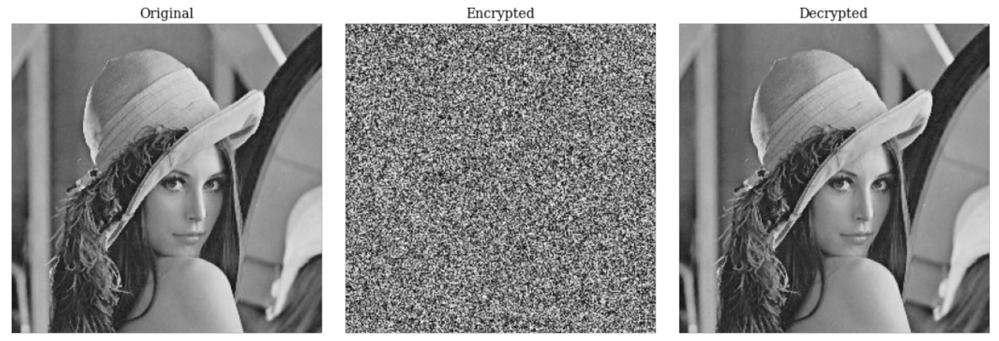
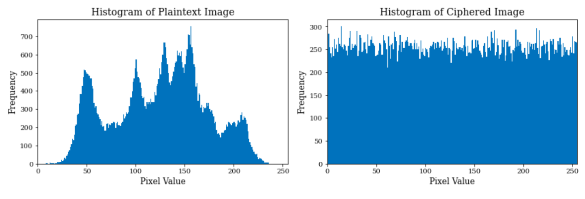
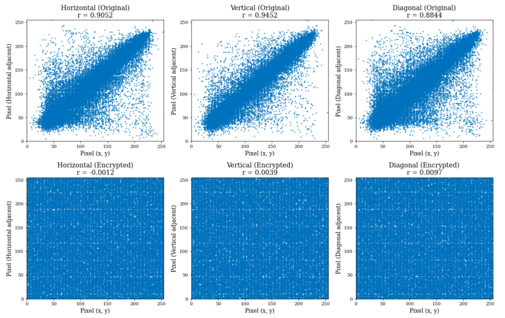

# FPGA Implementation of a Chaos-Based Symmetric Image Encryption Algorithm

This repository contains the hardware implementation of a high-efficiency chaos-based symmetric image encryption accelerator, designed for secure, low-latency multimedia demands in 5G-IoT edge devices.

## 🚀 Key Features
- **Chaotification Technique:** Transforms stable linear systems into a robust Pseudo-Random Number Generator (PRNG).
- **Dynamic Synthesis:** Real-time generation of S-boxes and cryptographic keys.
- **Optimized Architecture:** Core engine utilizing a Feistel network with AES transformations in Counter (CTR) mode.
- **Hardware Acceleration:** Fully implemented on Xilinx Zynq-7000 SoC (Arty-Z7).

---

## Experimental Results

### 1. Hardware Resource Utilization
The design was synthesized and implemented on the **Xilinx Arty-Z7 (XC7Z020)**. It demonstrates high efficiency with low logic footprints.


| Resources | Standalone IP | Full SoC System | Available | Utilization (%) |
| :--- | :---: | :---: | :---: | :---: |
| **LUTs** | 13,451 | 13,872 | 53,200 | 26.08% |
| **FFs** | 24,450 | 25,496 | 106,400 | 23.96% |
| **DSP** | 81 | 81 | 220 | 36.82% |
| **BRAM** | 48 | 48 | 140 | 34.29% |

- **Max Frequency:** 144.11 MHz
- **Power Consumption:** 0.491 W (Total)

### 2. Execution Time & Throughput
Performance measured at a **100 MHz** clock frequency for a **256x256** grayscale image.


| Operating Mode | Description | Execution Time |
| :--- | :--- | :---: |
| **Mode 1** | Full Pipeline (S-box synthesis + Key gen + Encryption) | **4.79 ms** |
| **Mode 3** | Standalone Decryption (using cached keys) | **1.00 ms** |

### 3. Security Evaluation (Lena 256x256)
The cryptosystem provides robust resistance against common cryptographic attacks.

- **Information Entropy:** **7.9976** (Near-ideal 8.0).
- **Histogram:** 
  
- **Correlation Coefficients (CC):** Horizontal: **-0.0012**; Vertical: **0.0039**; Diagonal: **0.0097**
  
- **Diffusion Analysis:**
  - **NPCR:** 99.6155% (Ideal: 99.6094%)
  - **UACI:** 33.4572% (Ideal: 33.4635%)

---

## NIST Statistical Test Suite (STS) Results

The chaos-based PRNG was evaluated using the NIST Statistical Test Suite (STS).
The complete final analysis report generated by NIST is provided below.

```sh
>>> cat NIST_test/NIST-Statistical-Test-Suite/sts/experiments/AlgorithmTesting/finalAnalysisReport.txt
------------------------------------------------------------------------------
RESULTS FOR THE UNIFORMITY OF P-VALUES AND THE PROPORTION OF PASSING SEQUENCES
------------------------------------------------------------------------------
   generator is <prng_bits.txt>
------------------------------------------------------------------------------
 C1  C2  C3  C4  C5  C6  C7  C8  C9 C10  P-VALUE  PROPORTION  STATISTICAL TEST
------------------------------------------------------------------------------
  3   0   2   1   1   0   0   1   1   1  0.534146      9/10      Frequency
  4   1   0   0   2   0   1   2   0   0  0.066882      9/10      BlockFrequency
  3   0   0   3   0   0   0   0   2   2  0.066882      9/10      CumulativeSums
  3   0   1   1   0   1   2   0   0   2  0.350485      9/10      CumulativeSums
  1   1   4   0   0   2   0   1   1   0  0.122325     10/10      Runs
  2   1   0   0   1   0   2   2   1   1  0.739918     10/10      LongestRun
  1   2   1   0   1   0   0   2   3   0  0.350485     10/10      Rank
  0   1   1   2   0   1   1   2   0   2  0.739918     10/10      FFT
  1   1   0   1   0   1   2   2   0   2  0.739918     10/10      NonOverlappingTemplate
  0   0   2   1   0   2   0   1   2   2  0.534146     10/10      NonOverlappingTemplate
    ... many output lines omitted for clarity ...
  1   0   1   2   0   1   2   1   1   1  0.911413     10/10      NonOverlappingTemplate
  2   0   1   1   0   1   0   1   3   1  0.534146     10/10      OverlappingTemplate
 10   0   0   0   0   0   0   0   0   0  0.000000 *    0/10   *  Universal
  0   0   0   2   3   1   1   2   0   1  0.350485     10/10      ApproximateEntropy
  0   0   0   0   0   0   0   1   0   0     ----       1/1       RandomExcursions
  0   0   0   0   0   0   0   1   0   0     ----       1/1       RandomExcursions
  0   0   0   0   0   0   1   0   0   0     ----       1/1       RandomExcursions
  0   0   0   0   0   0   0   0   1   0     ----       1/1       RandomExcursions
  0   0   0   0   1   0   0   0   0   0     ----       1/1       RandomExcursions
  0   0   0   0   0   0   1   0   0   0     ----       1/1       RandomExcursions
  0   1   0   0   0   0   0   0   0   0     ----       1/1       RandomExcursions
  0   0   0   0   0   0   0   0   0   1     ----       1/1       RandomExcursions
  0   0   0   0   0   0   1   0   0   0     ----       1/1       RandomExcursionsVariant
  0   0   0   0   0   0   1   0   0   0     ----       1/1       RandomExcursionsVariant
  0   0   0   0   0   0   0   1   0   0     ----       1/1       RandomExcursionsVariant
  0   0   0   0   0   0   0   0   1   0     ----       1/1       RandomExcursionsVariant
  0   0   0   0   0   0   0   0   1   0     ----       1/1       RandomExcursionsVariant
  0   0   0   0   1   0   0   0   0   0     ----       1/1       RandomExcursionsVariant
  1   0   0   0   0   0   0   0   0   0     ----       1/1       RandomExcursionsVariant
  1   0   0   0   0   0   0   0   0   0     ----       1/1       RandomExcursionsVariant
  0   1   0   0   0   0   0   0   0   0     ----       1/1       RandomExcursionsVariant
  0   0   0   1   0   0   0   0   0   0     ----       1/1       RandomExcursionsVariant
  0   0   0   0   0   1   0   0   0   0     ----       1/1       RandomExcursionsVariant
  0   0   0   0   1   0   0   0   0   0     ----       1/1       RandomExcursionsVariant
  0   0   1   0   0   0   0   0   0   0     ----       1/1       RandomExcursionsVariant
  0   0   1   0   0   0   0   0   0   0     ----       1/1       RandomExcursionsVariant
  0   0   0   1   0   0   0   0   0   0     ----       1/1       RandomExcursionsVariant
  0   0   0   0   1   0   0   0   0   0     ----       1/1       RandomExcursionsVariant
  0   0   0   0   1   0   0   0   0   0     ----       1/1       RandomExcursionsVariant
  0   0   0   0   0   0   1   0   0   0     ----       1/1       RandomExcursionsVariant
  0   0   0   2   3   2   0   2   0   1  0.213309     10/10      Serial
  1   3   0   0   1   2   1   1   1   0  0.534146     10/10      Serial
  0   0   0   1   3   0   0   2   3   1  0.122325     10/10      LinearComplexity


- - - - - - - - - - - - - - - - - - - - - - - - - - - - - - - - - - - - - - - - -
The minimum pass rate for each statistical test with the exception of the
random excursion (variant) test is approximately = 8 for a
sample size = 10 binary sequences.

The minimum pass rate for the random excursion (variant) test
is approximately = 0 for a sample size = 1 binary sequences.

For further guidelines construct a probability table using the MAPLE program
provided in the addendum section of the documentation.
- - - - - - - - - - - - - - - - - - - - - - - - - - - - - - - - - - - - - - - - -
```
